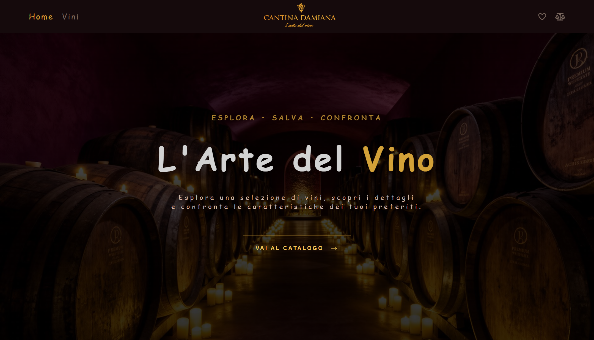
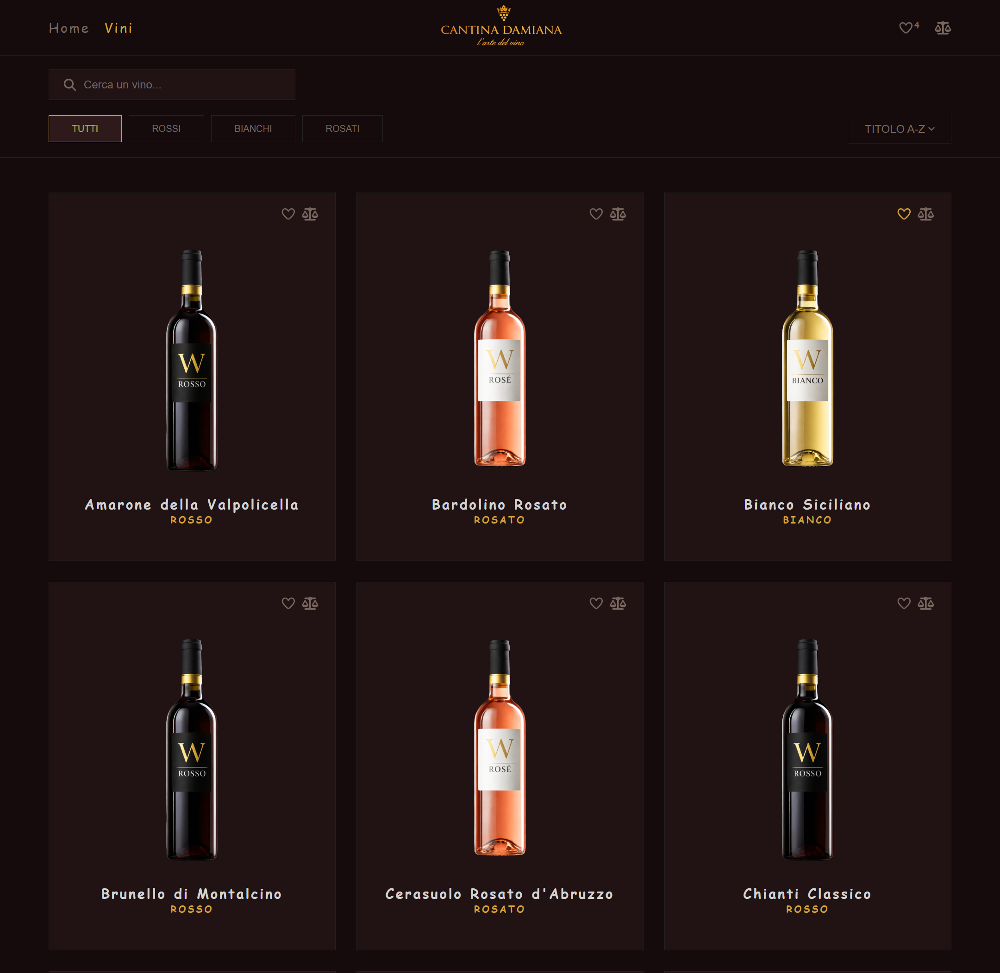
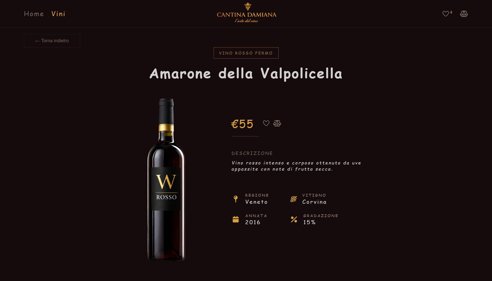
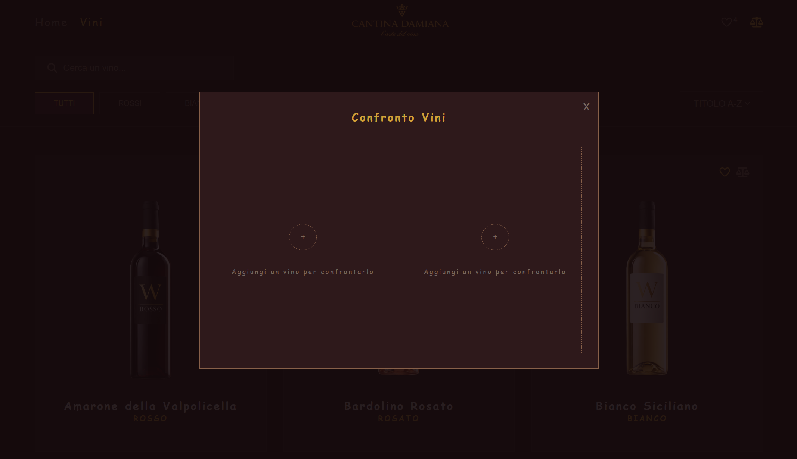
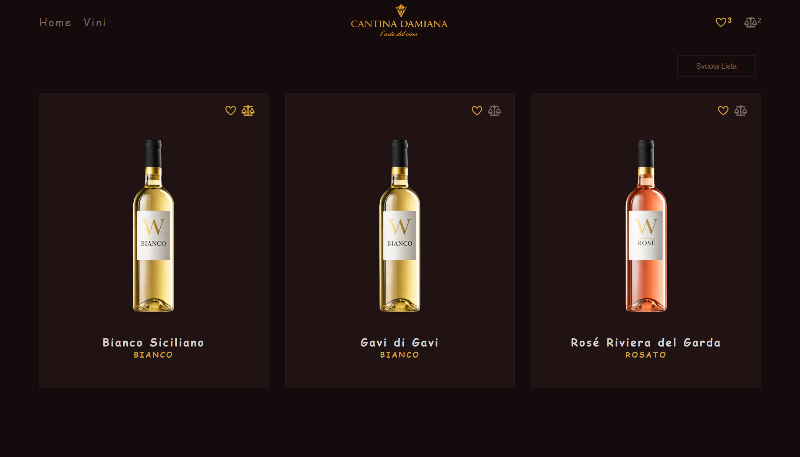
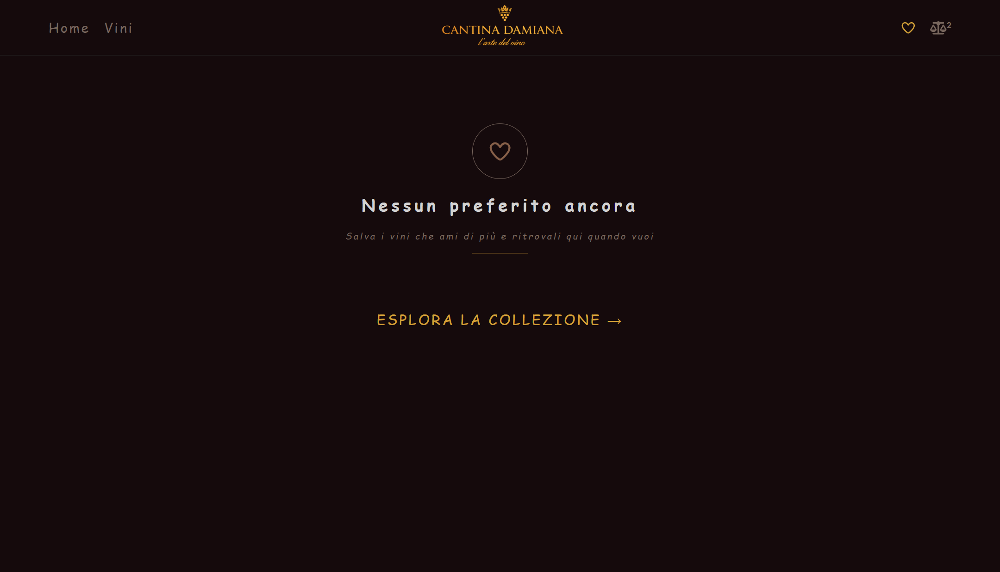
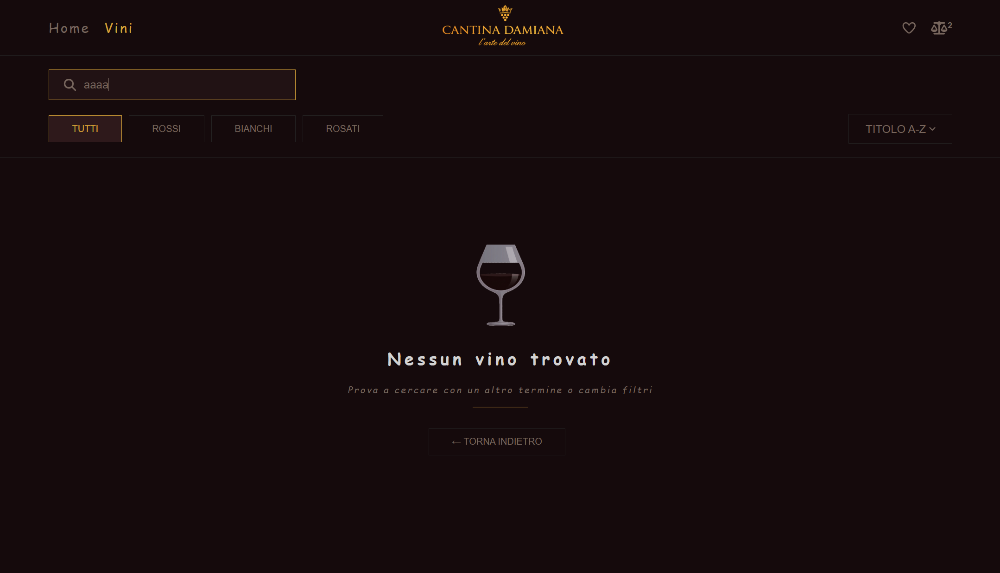
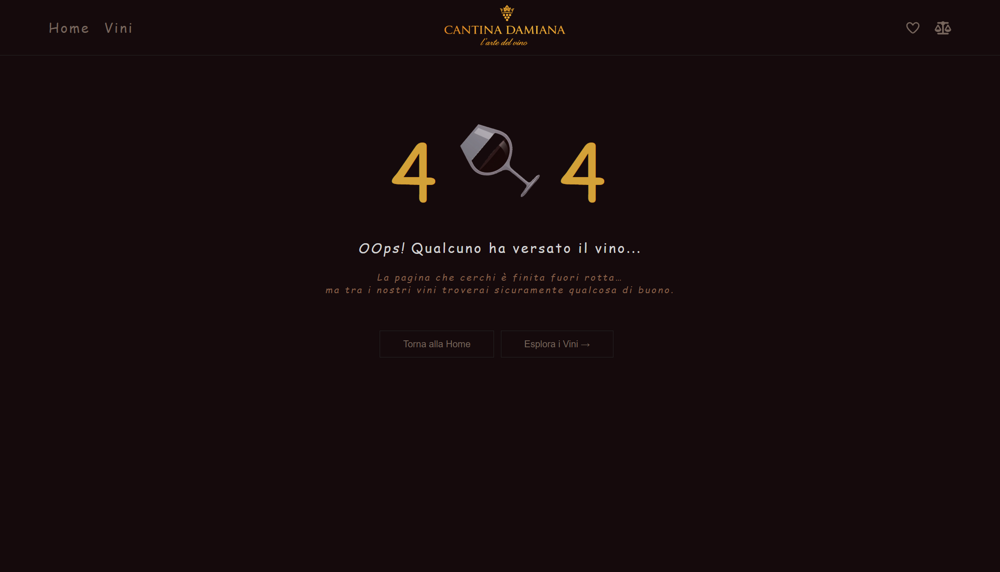

<h1 align="center">🍷 Esplora, Salva e Confronta vini</h1>

Single Page Application (SPA) realizzata con React che consente all’utente di esplorare un catalogo di vini, visualizzarne i dettagli e interagire con i contenuti tramite ricerca per titolo, filtri per categoria e ordinamento dei risultati, oltre a salvare i vini nei preferiti e confrontarne le caratteristiche.

## Anteprima applicazione

### Home



### Catalogo vini
Pagina principale per l'esplorazione del catalogo con ricerca, filtri e ordinamento.



### Dettaglio vino
Visualizzazione delle informazioni complete di un vino selezionato.



### Confronto vini

Confronto tra due vini tramite modale dedicata.

<p align="center">
  
  
</p>

### Preferiti

Gestione dei vini salvati nei preferiti.

<p align="center">
  
  
</p>


### Ricerca
Gestione dello stato in cui la ricerca non restituisce risultati.



---

### Pagina 404

Pagina mostrata quando l'utente tenta di accedere ad una rotta inesistente.



## Architettura dell'applicazione

Lo schema seguente mostra la struttura principale dell'applicazione: i **Provider** che gestiscono i context globali, il **layout principale** organizzato con `Outlet` per il rendering dinamico delle pagine e i **componenti principali** utilizzati nelle diverse sezioni dell'app.

È inoltre presente una **modale di confronto**, accessibile da diverse pagine dell'applicazione, che permette di confrontare le caratteristiche di due vini selezionati.


## Tecnologie utilizzate

- React
- React Router
- Vite
- CSS
- Font Awesome
- Lucide Icons


## Setup del progetto

### 1. Clona la repository del frontend

```bash
git clone https://github.com/Damiana-Arangio/progetto-finale-spec-frontend-front.git
cd progetto-finale-spec-frontend-front
npm install
npm run dev
```

### 2. Clona la repository del backend

```bash
git clone https://github.com/boolean-it/progetto-finale-spec-frontend-back.git
cd progetto-finale-spec-frontend-back
npm install
npm run dev
```

Il backend genera automaticamente gli endpoint REST a partire dal tipo definito nel file `types.ts`.

Nel progetto frontend è inclusa una cartella `backend` che contiene:

- il file `types.ts`
- il database JSON della risorsa utilizzata

Per avviare correttamente il backend, copia questi file nella cartella del backend clonato, rispettivamente nelle directory:

- `types.ts` nella root del backend
- il file JSON nella cartella `database/`

## 👩‍💻 Damiana Arangio  

Progetto finale – Specializzazione Frontend (Boolean)