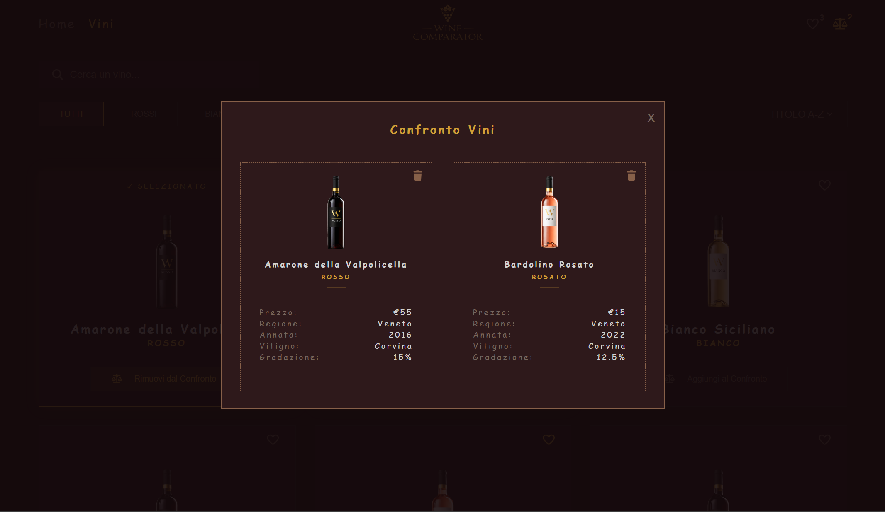
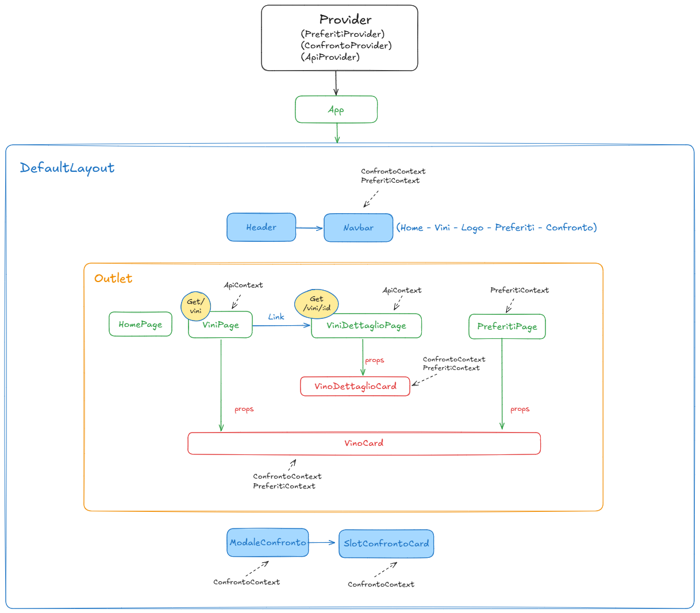

<h1 align="center">🍷 Wine Comparator</h1>

**Wine Comparator** è una Single Page Application (SPA) sviluppata con **React** che consente di:

* Visualizzare una lista di vini
* Consultare i dettagli di ogni vino
* Salvare vini nei preferiti
* Confrontare due vini selezionati

L'applicazione include funzionalità di ricerca, filtro e ordinamento dei dati.


## 🎥 Demo
<p>
  
</p>

## 📸 Screenshot

### Lista vini


### Comparatore


## Funzionalità principali
- Ricerca vini con debounce
- Filtri per categoria (rosso, bianco, rosato)
- Ordinamento per titolo (A-Z / Z-A)
- Gestione vini preferiti (persistenza con localStorage)
- Confronto tra due vini tramite modale
- Pagina dettaglio di un singolo vino
- Gestione stati vuoti (nessun risultato / preferiti vuoti)
- Pagina 404 personalizzata

## Implementazione tecnica
- Debounce per ottimizzare le chiamate API
- useMemo per evitare ricalcoli inutili
- useCallback per stabilizzare le funzioni tra i render
- Context API per la gestione dello stato globale + custom hooks
- localStorage per la persistenza dei preferiti
- React.memo per ottimizzazione dei componenti renderizzati in lista

## Stack
- React
- React Router DOM
- Vite
- CSS
- Font Awesome
- Lucide Icons

## Architettura dell'applicazione
Lo schema seguente mostra la struttura principale dell'applicazione: i **Provider** che gestiscono i context globali, il **layout principale** organizzato con `Outlet` per il rendering dinamico delle pagine e i **componenti principali** utilizzati nelle diverse sezioni dell'app.

È inoltre presente una **modale di confronto**, accessibile da diverse pagine dell'applicazione, che permette di confrontare le caratteristiche di due vini selezionati.




## Setup del progetto

### 1. Clona la repository del frontend

```bash
git clone https://github.com/Damiana-Arangio/progetto-finale-spec-frontend-front.git
cd progetto-finale-spec-frontend-front
npm install
npm run dev
```

### 2. Clona la repository del backend

```bash
git clone https://github.com/boolean-it/progetto-finale-spec-frontend-back.git
cd progetto-finale-spec-frontend-back
npm install
npm run dev
```

Il backend genera automaticamente gli endpoint REST a partire dal tipo definito nel file `types.ts`.

Nel progetto frontend è inclusa una cartella `backend` che contiene:

- il file `types.ts`
- il database JSON della risorsa utilizzata

Per avviare correttamente il backend:
- copia types.ts nella root del backend
- copia il file JSON nella cartella database/

## 👩‍💻 Damiana Arangio  

Progetto finale – Specializzazione Frontend (Boolean)